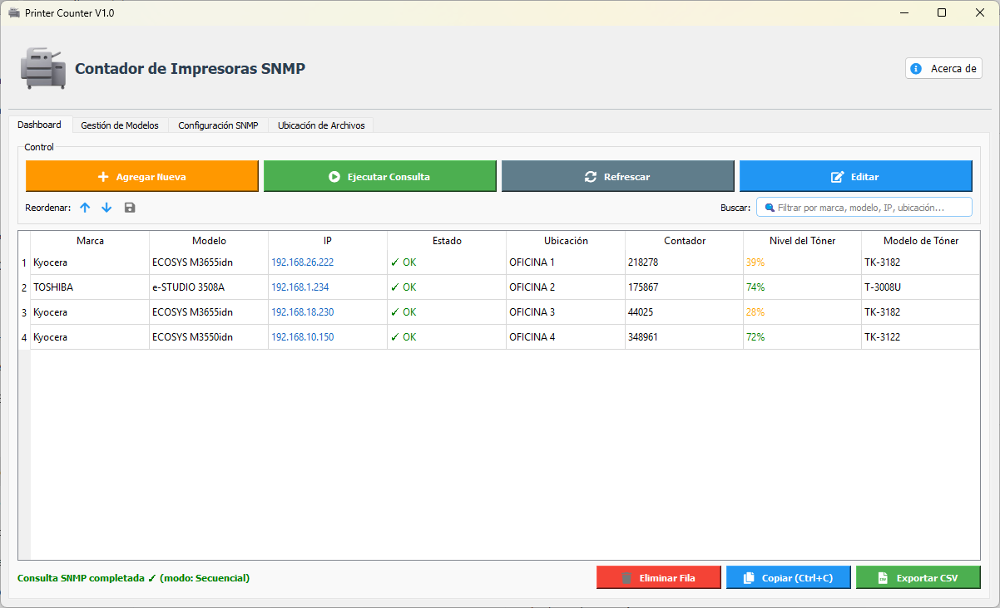
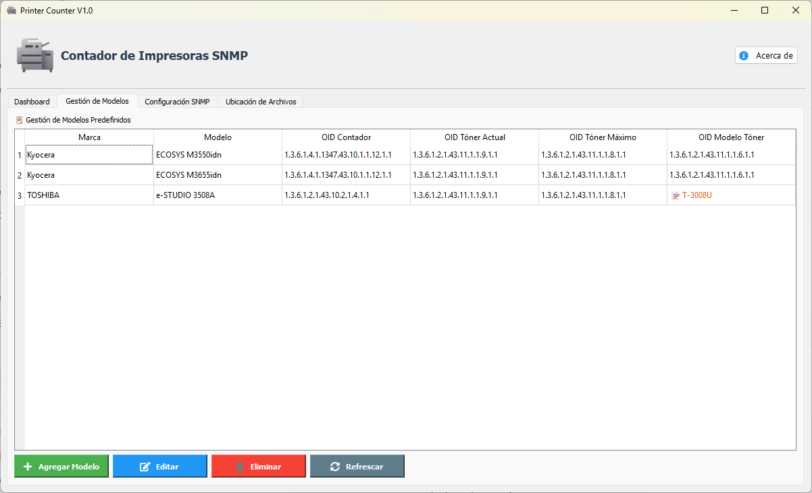
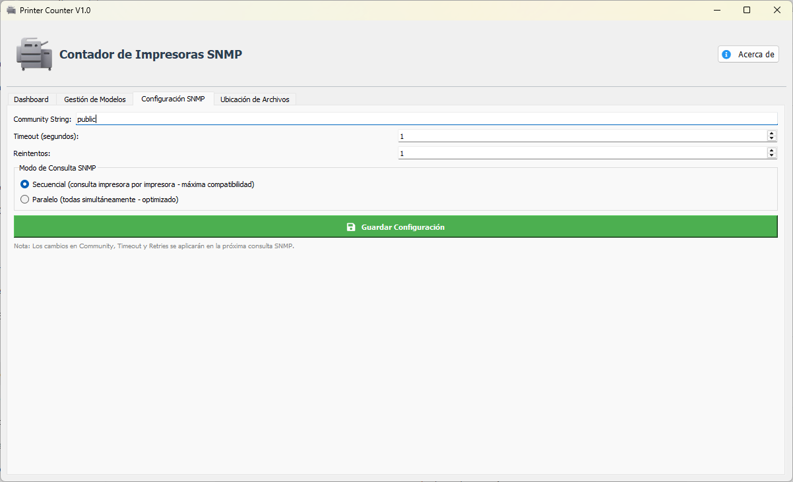

# Printer Counter SNMP

[](https://www.gnu.org/licenses/gpl-3.0)
[](https://www.python.org/downloads/)

Aplicación de escritorio para la centralización y consulta de contadores de impresoras en red mediante el protocolo SNMP.

## Vista Previa

*Panel principal de monitoreo*

<p float="left">
  
  
</p>
*Mantenimiento de dispositivos y configuración de red*

---

## Características

- Consulta centralizada de contadores en tiempo real
- Estados Online/Offline de impresoras
- Gestión de marcas y modelos con OIDs personalizados
- Acceso a la interfaz web de la impresora haciendo clic en la IP
- Modo de almacenamiento local o en carpeta compartida de red (SMB)
- Exportación de datos a CSV
- Portable, sin instalación requerida

---

## Requisitos

- Python 3.13 o superior
- Dependencias: `PyQt5`, `qtawesome`, `pysnmp-lextudio`

---

## Instalación y uso

1. Clona el repositorio:
   ```
   git clone https://github.com/fvergara97/Printer_Counter.git
   ```

2. Instala las dependencias:
   ```
   pip install PyQt5 qtawesome pysnmp-lextudio
   ```

3. Ejecuta la aplicación:
   ```
   python main.py
   ```

---

## Compilar el ejecutable (.exe)

Para generar el ejecutable portable en Windows:

1. Abre una terminal en la carpeta del proyecto.
2. Ejecuta `build.bat`.
3. El ejecutable quedará en `dist/Printer_Counter_V1.0.exe`.

---

## Configuración

El archivo `printers.json` se genera solo y almacena la base de datos de impresoras y credenciales SNMP.
Usa `printers_ejemplo.json` como guía para crear tu propia configuración.

---

## Licencia

Este proyecto se distribuye bajo la licencia GNU General Public License v3.0.
Consulta el archivo [LICENSE](LICENSE) para más detalles.

---

## Autor

Fernando A. Muñoz Vergara - https://github.com/fvergara97
